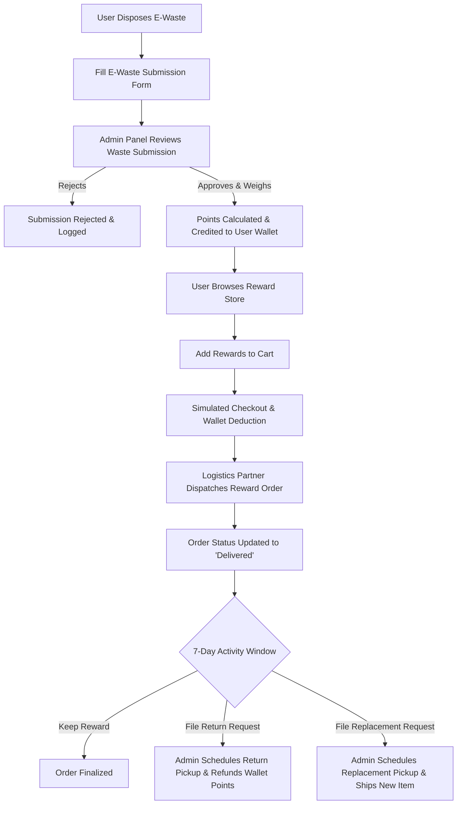

# ♻️ E-Waste Drop Point & Recycling Incentive Platform

An enterprise-grade, highly responsive, and premium web application designed to combat the rising global issue of electronic waste. The platform bridges the gap between eco-conscious citizens and certified recycling facilities by introducing a **gamified incentive model**. Users can safely dispose of their e-waste, earn point rewards directly in their digital wallet, and redeem those points for real-world products in a fully featured E-commerce Rewards Store. 

It also includes a robust, permission-controlled **Admin Control Dashboard** for managing waste inspection, wallet transactions, logistics pickups, and replacement/return lifecycle operations.

---

## 🚀 Architectural Workflow

The following flowchart illustrates the end-to-end user lifecycle and admin synchronization flow:



---

## 🌟 Key Product Features

### 1. 🧑‍💻 Public Eco-System (User Facing Portal)
*   **Dynamic Drop-Point Locator (Leaflet & OpenStreetMap):** Interactive map integration with custom marker groupings showing certified local e-waste collection bins, complete with geofenced distance calculations and routing instructions.
*   **Verified E-Waste Submission Form:** A seamless multi-step submission portal where users register e-waste items, specify brand/model, upload images, and describe their conditions.
*   **Interactive Incentive Rules:** Transparent conversion rules letting users calculate expected wallet returns prior to dropping off items.
*   **Premium Reward Store:** A sleek, fluid retail experience featuring category-based filtering, reactive search parameters, and point-range filters.
*   **Advanced Checkout & Wallet Manager:** Real-time wallet validation that prevents checkout if points are insufficient. Includes an dynamic checkout wizard (Address management, Delivery methods, Point Summary).
*   **Self-Service Customer Dashboard (Return & Replace):** 
    *   **My Orders:** Track real-time delivery status, download invoices, or cancel pending requests.
    *   **Returns Portal:** Request partial/full returns of orders within 7 days, reflecting points back into the user wallet upon verification.
    *   **Replacements Portal:** Manage product replacements with interactive pickup status timelines.

### 2. 🛡️ Enterprise Admin Command Panel (`/admin`)
*   **E-Waste Submissions Manager:** Complete list of submissions with options to verify details, update status (Pending, Inspected, Collected, Credited), and trigger automatic wallet rewards.
*   **Interactive Category & Brand Mapping:** Control allowed brands and item categories dynamically, updating the submission forms instantaneously.
*   **Wallet & Transactions Ledger:** Fully auditable history of points credited (for recycled items) and points debited (for reward purchases).
*   **Logistics, Returns & Replacements Dashboard:** Dedicated panels for coordinating pickups, updating replacement statuses, scheduling logistics partners, and verifying quality control on returned items.
*   **Education Content Management (CMS):** Build, write, and format blogs or guides concerning the environmental impacts of e-waste, pushing them to the public interface.

---

## 🛠️ Technology Stack & Dependencies

*   **UI Library & Core:** React 19 (Hooks, Context API, Modular Architecture)
*   **Routing System:** React Router Dom v7 (Layout nesting, private/public routing splits, dynamic parameter matching)
*   **Styling & Responsiveness:** Vanilla CSS Custom Properties (Sleek dark themes, Glassmorphism, animations) coupled with Bootstrap 5 grid utilities.
*   **Geospatial & Mapping:** Leaflet, React Leaflet, and Leaflet Routing Machine.
*   **Backend Integration:** Axios (configured with custom Interceptors, automatic JWT token checks, custom headers, and robust error fallback mechanisms).
*   **Testing Suites:** React Testing Library, Jest.

---

## 📂 Modular Workspace Directory Structure

```bash
e-waste-frontend/
├── public/                      # Static public assets (favicons, manifest.json)
├── scripts/                     # Python utility & database scripts
│   ├── add_sample_data.py
│   ├── check_db.py
│   └── ...
├── src/
│   ├── assets/                  # Global assets (images, logos, illustrations)
│   │   ├── images/
│   │   │   └── ewaste_illustration.png
│   │   └── logo.svg
│   │
│   ├── components/              # Global reusable UI components
│   │   ├── common/              # Common layout elements
│   │   │   ├── Header/
│   │   │   │   ├── Header.jsx
│   │   │   │   └── Header.css
│   │   │   └── Footer/
│   │   │       ├── Footer.jsx
│   │   │       └── Footer.css
│   │   │
│   │   ├── ui/                  # Atom-level UI (Buttons, Inputs, Modals, Cards)
│   │   │   └── CategoryFilter/  
│   │   │       ├── CategoryFilter.jsx
│   │   │       └── CategoryFilter.css
│   │   └── UserFilter/          
│   │       ├── UserFilter.jsx
│   │       └── UserFilter.css
│   │
│   ├── features/                # Domain-specific modules (Self-contained logic)
│   │   ├── admin/               # Admin features grouped logically
│   │   │   ├── assets/          # Admin-specific styles/layouts
│   │   │   │   └── admin.css
│   │   │   ├── components/      # Shared admin UI components
│   │   │   │   └── AdminHeader.jsx
│   │   │   └── modules/         # Grouped admin business domains
│   │   │       ├── users/       # Users, User Wallets
│   │   │       ├── ewaste/      # Submissions, Status history
│   │   │       ├── rewards/     # Rules, conditions, products, categories, orders, refunds
│   │   │       ├── content/     # Home management, Education management
│   │   │       └── catalogue/   # Brands, categories, models, mappings
│   │   │
│   │   ├── auth/                # Login, Sign-Up features
│   │   │   ├── components/
│   │   │   └── hooks/
│   │   │
│   │   └── user/                # User dashboard features (MyOrders, MyReturns, MyReplaces)
│   │
│   ├── layouts/                 # Layout wrappers
│   │   ├── PublicLayout.jsx
│   │   └── AdminLayout.jsx
│   │
│   ├── pages/                   # Standalone page views (Routing destinations)
│   │   ├── About/
│   │   ├── ContactUs/
│   │   ├── Education/
│   │   ├── FacilityMap/
│   │   ├── Home/
│   │   ├── RecyclingInfo/
│   │   └── Rules/
│   │
│   ├── services/                # Global API service configurations
│   │   └── api.js
│   │
│   ├── styles/                  # Global stylesheets
│   │   ├── App.css
│   │   ├── index.css
│   │   └── style.css
│   │
│   ├── App.js                   # Main routing definition
│   └── index.js                 # React DOM bootstrapper
│
├── .env.example
├── .gitignore
├── package.json
└── README.md
```

---

## ⚙️ Running Locally

Follow these steps to set up the frontend environment:

1.  **Clone the Repository:**
    ```bash
    git clone https://github.com/khushalNariya/e-waste-frontend.git
    cd e-waste-frontend
    ```

2.  **Install Node Dependencies:**
    ```bash
    npm install
    ```

3.  **Environment Setup:**
    Create a `.env` file in the root directory based on `.env.example`:
    ```env
    REACT_APP_API_URL=http://127.0.0.1:1000/
    ```

4.  **Launch the Local Development Server:**
    ```bash
    npm start
    ```
    *The app will launch on `http://localhost:2000` automatically.*

5.  **Build for Production:**
    ```bash
    npm run build
    ```
    *Outputs highly optimized static assets inside the `/build` directory.*

---

## 💎 Key Achievements & Professional Value (For HR & Technical Heads)

As the lead front-end developer for this platform, this project showcases my expertise in resolving highly complex frontend requirements:

> [!TIP]
> **1. Production-Grade Network Resiliency**
> Created an absolute state-of-the-art API pipeline using `axios` interceptors. It handles token expiration, auto-checks JWT headers, and ensures that even if the backend is temporarily slow, the user is greeted with a smooth fallback instead of UI crashes.

> [!IMPORTANT]
> **2. High-Fidelity Maps & Navigation**
> Engineered a customized geolocation experience using React-Leaflet and Leaflet Routing Machine. Rather than displaying boring static pointers, the platform actively maps driving/walking directions from the user's current coordinates to the chosen drop point.

> [!NOTE]
> **3. Multi-Step Workflows & State Synchronization**
> Implemented complex multi-phase checkout and return forms. State changes in the user's order statuses instantly link to wallet deductions, return validation matrices, and automatic point updates using React's unidirectional data flow.

---

### 🛡️ Eco-Friendly Code & Design
Made with ❤️ for a cleaner, greener planet. 
For feedback, questions, or corporate opportunities, feel free to reach out via GitHub!
